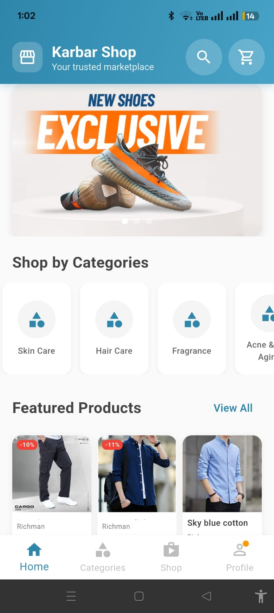
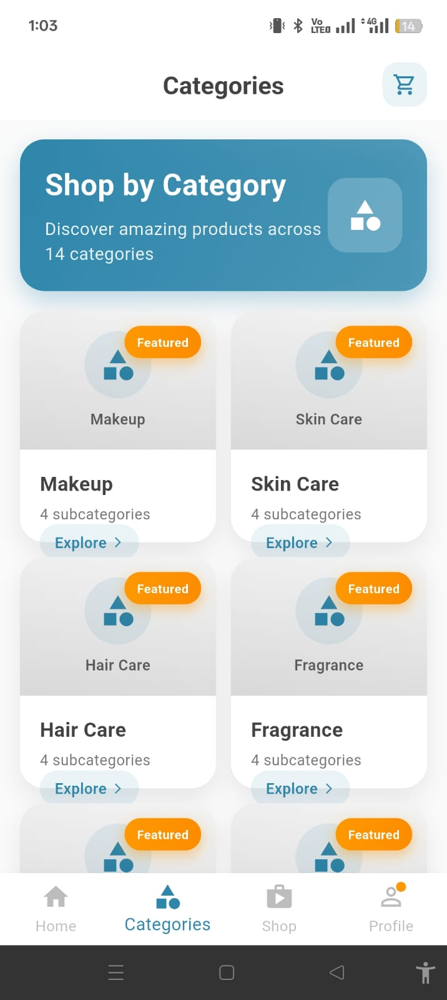
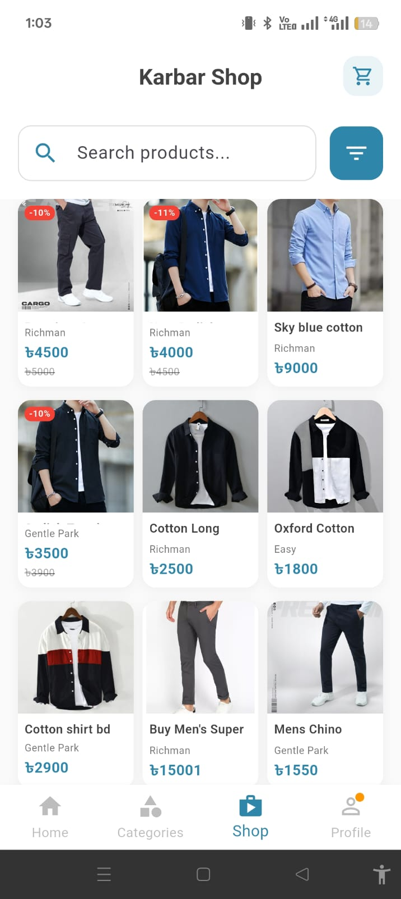
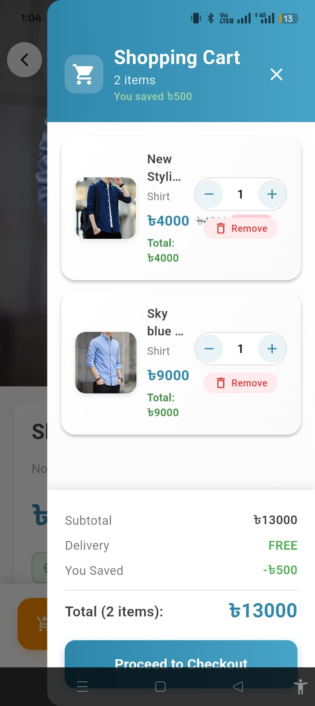
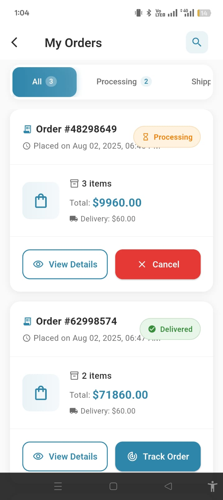
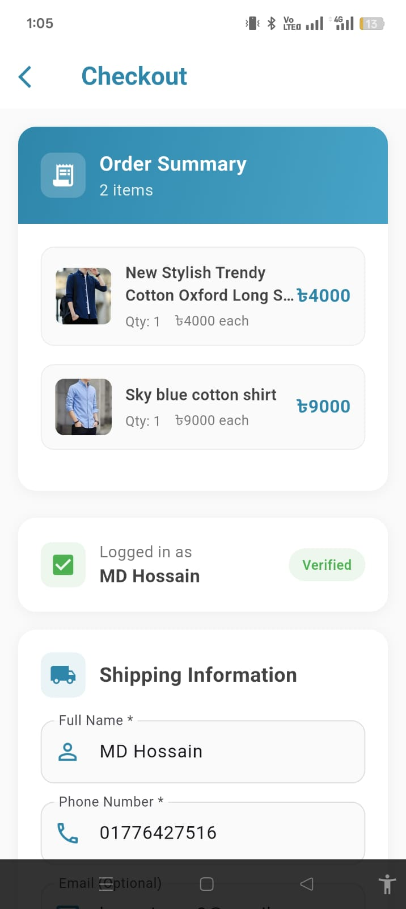
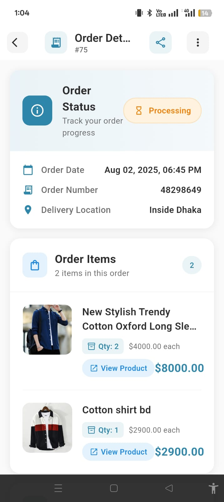

# Karbar Shop - Flutter Ecommerce Mobile App

A modern, feature-rich ecommerce mobile application built with Flutter, featuring a clean UI, smooth navigation, and comprehensive shopping functionality.

## 🚀 Features

### Core Features
- **Product Catalog**: Browse products with categories and search functionality
- **Shopping Cart**: Add, remove, and manage items in cart
- **User Authentication**: Login, registration, and profile management
- **Order Management**: Place orders, track status, and view order history
- **Wishlist**: Save favorite products for later
- **Product Details**: Detailed product information with images and descriptions

### Technical Features
- **State Management**: Provider pattern for efficient state management
- **API Integration**: RESTful API integration for backend communication
- **Local Storage**: Secure token storage and cart persistence
- **Navigation**: Bottom navigation with protected routes
- **Responsive Design**: Adaptive UI for different screen sizes
- **Error Handling**: Comprehensive error handling and logging

## 📱 Screenshots

| Home Screen | Categories | Product Details | Cart |
|:-----------:|:----------:|:---------------:|:----:|
|  |  |  |  |

| Profile | Orders | Checkout |                        Order Details                        |
|:-------:|:------:|:--------:|:-----------------------------------------------------------:|
|  |  |  | ) |

## 🛠 Installation

### Prerequisites
- Flutter SDK (>=3.0.0)
- Dart SDK (>=3.0.0)
- Android Studio / VS Code
- Android SDK for Android development
- Xcode for iOS development (macOS only)

### Setup Instructions

1. **Clone the repository**
   ```bash
   git clone https://github.com/hossaincse2/Ecommerce-Flutter-App.git
   cd Ecommerce-Flutter-App
   ```

2. **Install dependencies**
   ```bash
   flutter pub get
   ```

3. **Configure API endpoints**
    - Create `lib/config/app_config.dart`
    - Update API base URLs and configuration

4. **Run the app**
   ```bash
   # Debug mode
   flutter run

   # Release mode
   flutter run --release
   ```

## 📦 APK Download

### Latest Release (v1.0.0)
- **File Size**: ~15 MB
- **Min Android Version**: Android 5.0 (API level 21)
- **Target Android Version**: Android 14 (API level 34)

**Download Links:**
- [📱 Download APK (arm64-v8a)](https://github.com/hossaincse2/Ecommerce-Flutter-App/blob/main/release/app-ecommerce.apk)

### Installation Instructions
1. Download the appropriate APK file for your device
2. Enable "Install from Unknown Sources" in your Android settings
3. Open the downloaded APK file and follow the installation prompts
4. Launch the app and enjoy shopping!

## 🎥 Demo Video

### App Walkthrough
Watch our comprehensive demo video showcasing all the key features:

[](https://www.loom.com/share/670fc01cb065468da154f73ebcad85fd?sid=bfc6a420-e171-4d27-a7bf-f86d07583bc3)

**Video Contents:**
- 0:00 - App Launch & Splash Screen
- 0:15 - Home Screen Navigation
- 0:30 - Product Browsing & Categories
- 1:00 - Product Details & Add to Cart
- 1:30 - Shopping Cart Management
- 2:00 - User Authentication Flow
- 2:30 - Checkout Process
- 3:00 - Order Tracking
- 3:30 - Profile Management
- 4:00 - Settings & Preferences

### Quick Feature Preview
- **Duration**: 4 minutes 30 seconds
- **Quality**: 1080p HD
- **Format**: MP4

## 🏗 Project Structure

```
lib/
├── config/
│   └── app_config.dart
├── models/
│   ├── product.dart
│   ├── category.dart
│   ├── cart_item.dart
│   ├── order.dart
│   └── user.dart
├── screens/
│   ├── auth/
│   │   ├── login_screen.dart
│   │   ├── registration_screen.dart
│   │   ├── forgot_password_screen.dart
│   │   ├── profile_screen.dart
│   │   └── profile_update_screen.dart
│   ├── cart/
│   │   └── cart_screen.dart
│   ├── checkout/
│   │   └── checkout_screen.dart
│   ├── orders/
│   │   ├── my_order_screen.dart
│   │   ├── order_details_screen.dart
│   │   ├── order_tracking_screen.dart
│   │   └── order_success_screen.dart
│   ├── account/
│   │   └── my_account_screen.dart
│   ├── settings/
│   │   └── settings_screen.dart
│   ├── home_screen.dart
│   ├── categories_screen.dart
│   ├── category_products_screen.dart
│   ├── product_details_screen.dart
│   ├── shop_screen.dart
│   ├── wishlist_screen.dart
│   └── splash_screen.dart
├── services/
│   ├── api_service.dart
│   ├── order_api_service.dart
│   ├── auth_manager.dart
│   └── cart_service.dart
├── utils/
│   └── logger.dart
├── widgets/
│   ├── product_card.dart
│   ├── category_card.dart
│   ├── cart_item_widget.dart
│   └── custom_app_bar.dart
└── main.dart
```

## 🔧 Configuration

### Environment Setup
Create `lib/config/app_config.dart`:

```dart
class AppConfig {
  static const String appName = 'Karbar Shop';
  static const String environment = 'production'; // development, staging, production
  
  static const String baseUrl = 'https://api.karbarshop.com';
  static const String imageBaseUrl = 'https://cdn.karbarshop.com';
  
  // API Endpoints
  static const String loginEndpoint = '/auth/login';
  static const String registerEndpoint = '/auth/register';
  static const String productsEndpoint = '/products';
  static const String categoriesEndpoint = '/categories';
  static const String ordersEndpoint = '/orders';
}
```

### Dependencies
Key packages used in this project:

```yaml
dependencies:
  flutter:
    sdk: flutter
  provider: ^6.1.1
  http: ^1.1.0
  shared_preferences: ^2.2.2
  cached_network_image: ^3.3.0
  flutter_secure_storage: ^9.0.0
  image_picker: ^1.0.4
  permission_handler: ^11.0.1
```

## 🚦 Getting Started

### For Users
1. Download the APK from the releases section
2. Install the app on your Android device
3. Create an account or browse as a guest
4. Start shopping!

### For Developers
1. Clone the repository
2. Set up your development environment
3. Configure API endpoints
4. Run `flutter pub get`
5. Launch the app with `flutter run`

## 📱 Platform Support

| Platform | Status | Version |
|----------|--------|---------|
| Android | ✅ Supported | 5.0+ (API 21+) |
| iOS | ✅ Supported | 12.0+ |
| Web | 🚧 In Development | - |
| Windows | ❌ Not Planned | - |
| macOS | ❌ Not Planned | - |
| Linux | ❌ Not Planned | - |

## 🔐 Security Features

- **Secure Token Storage**: Using Flutter Secure Storage
- **API Authentication**: JWT token-based authentication
- **Input Validation**: Client-side and server-side validation
- **Secure HTTP**: All API calls use HTTPS
- **Session Management**: Automatic token refresh and logout

## 🎨 Design System

### Colors
- **Primary**: #2E86AB (Blue)
- **Secondary**: #A23B72 (Pink)
- **Success**: #F18F01 (Orange)
- **Error**: #C73E1D (Red)
- **Background**: #FFFFFF (White)
- **Surface**: #F8F9FA (Light Gray)

### Typography
- **Font Family**: Roboto
- **Headings**: Bold, various sizes
- **Body Text**: Regular, 16sp
- **Captions**: Light, 14sp

## 🤝 Contributing

We welcome contributions! Please follow these steps:

1. Fork the repository
2. Create a feature branch (`git checkout -b feature/main`)
3. Commit your changes (`git commit -m 'Add some main'`)
4. Push to the branch (`git push origin feature/main`)
5. Open a Pull Request

### Development Guidelines
- Follow Flutter/Dart style guidelines
- Write unit tests for new features
- Update documentation for any API changes
- Ensure all tests pass before submitting PR

## 📄 License

This project is licensed under the MIT License - see the [LICENSE](LICENSE) file for details.

## 📞 Support

### Getting Help
- **Documentation**: Check this README and inline code comments
- **Issues**: Report bugs on [GitHub Issues](https://github.com/yourusername/karbar-shop/issues)
- **Discussions**: Join discussions on [GitHub Discussions](https://github.com/yourusername/karbar-shop/discussions)

### Contact
- **Email**: support@karbarshop.com
- **Twitter**: [@KarbarShop](https://twitter.com/KarbarShop)
- **Website**: [https://karbarshop.com](https://karbarshop.com)

## 🔄 Version History

### v1.0.0 (Latest)
- Initial release
- Core ecommerce functionality
- User authentication
- Product catalog and search
- Shopping cart and checkout
- Order management
- Profile management

### Upcoming Features (v1.1.0)
- Push notifications
- Social media integration
- Advanced filtering
- Offline support
- Dark theme
- Multiple payment methods

## 📊 Performance

### App Performance Metrics
- **App Launch Time**: < 2 seconds
- **Screen Transition**: < 300ms
- **API Response Time**: < 1 second
- **Memory Usage**: < 150MB
- **Battery Impact**: Minimal

### Optimization Features
- Image caching and compression
- Lazy loading for product lists
- Efficient state management
- Minimized network requests
- Optimized build size

---

**Made with ❤️ using Flutter**

*This app demonstrates modern mobile development practices with Flutter, featuring clean architecture, responsive design, and smooth user experience.*